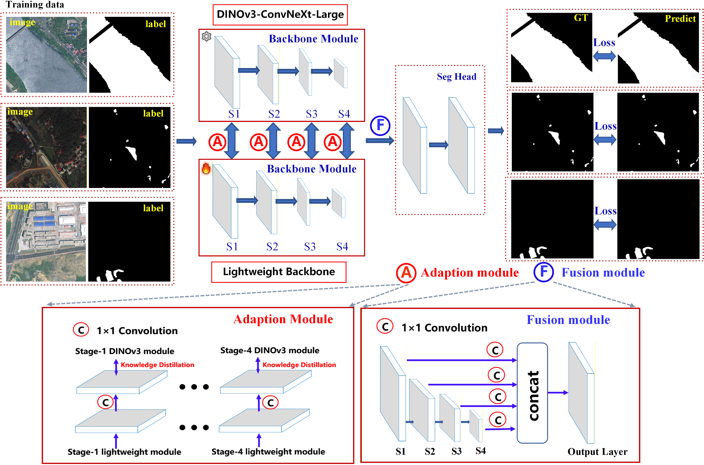
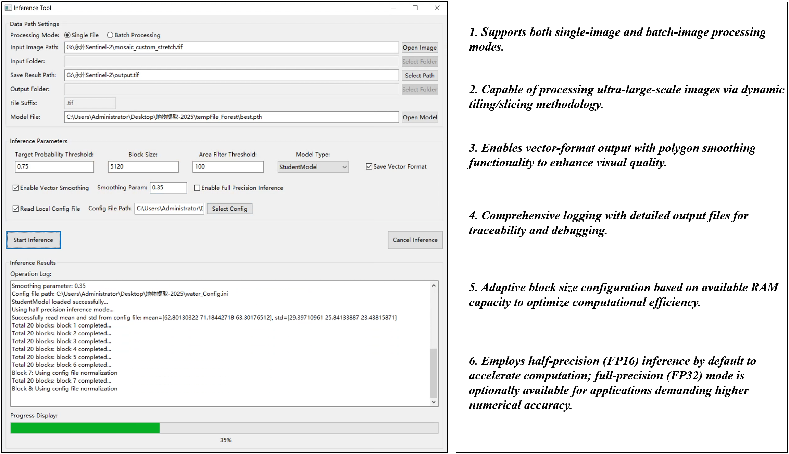

# DINOWaterNet
Water extraction on complicated scenarios.

## training dataset
we have built a large-scale water mapping dataset with ultra-high resolution optical remote sensing images, which can be see below, and it can be download from baiduDisk, using the following link:
```java
WaterDataset
Link: https://pan.baidu.com/s/1oIvJrIIYzSgaAYuEuiFIAg passkey: 1234 
```


## model structure
We use the iFormer-s as our backbone to build DINOWaterNet, the Parameter and inference time can test by using following code:
```python
python .\cal_Param.py
```


## performance test
we have tested the DINOWaterNet on very large-scale regions, and tested over 700GB ultra-high resolution remote sensing images, see below:


## software development
Based on GDAL,wxpython, etc, we have developed a user-friendly software, which can run successfully in Win10/11/Server operating system, and it can be download from the following link:
```python
DINOWaterNet-Software
Link: https://pan.baidu.com/s/1LaaIqJ7IRvsRjrfoXe4jfA passkey: 1234 
```

